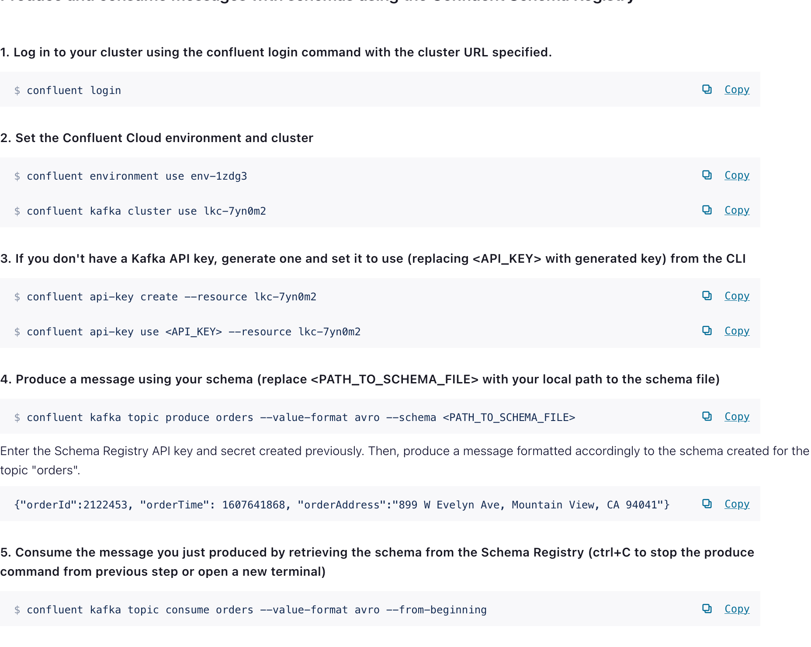

##

gh repo clone friendbear/100days-of-code-confluent-cloud-kafka


```
git checkout -b day2
```

## Create a Schema Registry

This is your Schema Registry API endpoint. You will need to pass this to your clients or other tooling to connect to Schema Registry and manage your schemas.

```
https://psrc-nx5kv.australia-southeast1.gcp.confluent.cloud
```

## Create API credentials

Different compatibility types define how schemas can evolve. The default compatibility type is "Backward", which allows optional fields to be added and fields to be deleted.


## Create API credentials

Next, create the API credentials you'll use to authenticate to Schema Registry to produce and consume messages in Kafka topics.

### Create a topic
Next, we'll create a new topic. Click "Continue" to navigate to the Topics page.


### Create a topic

Click here to create a topic. We will produce messages that conform to a schema associated with this topic.


## Create a topic

Let's name our topic "orders". Click "Create with defaults".


---

## Create a schema

Navigate to the Schema tab to set a schema for this topic.

### Create a schema
Create a schema that defines how messages for this topic must be structured. Both producers and consumers for this topic will use the same schema.


> Schema Registry supports JSON, Avro, and Protobuf schemas. For this tutorial we will use a ready-made, pre-populated schema. Choose a schema type.

```avro
{
  "type": "record",
  "namespace": "com.mycorp.mynamespace",
  "name": "sampleRecord",
  "doc": "Sample schema to help you get started.",
  "fields": [
    {
      "name": "orderId",
      "type": "int",
      "doc": "The id of the order."
    },
    {
      "name": "orderTime",
      "type": "int",
      "doc": "Timestamp of the order."
    },
    {
      "name": "orderAddress",
      "type": "string",
      "doc": "The address of the order."
    }
  ]
}
```


Click "Create" to create your schema in Schema Registry.


Download the schema so you can use it when producing messages to Kafka from the Confluent Cloud CLI



---
day2


