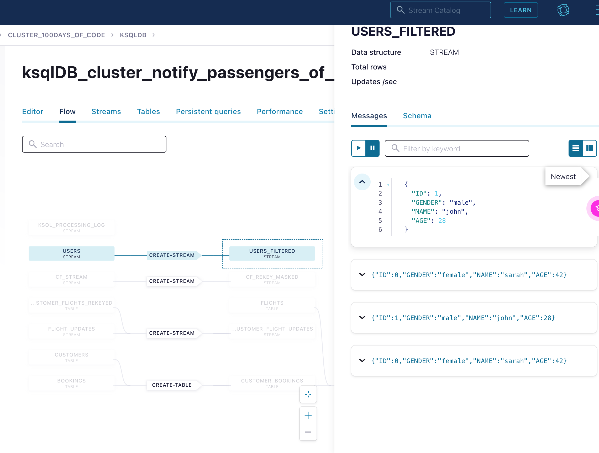
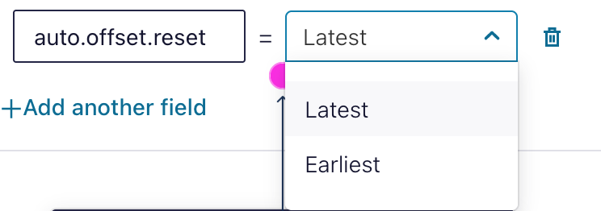
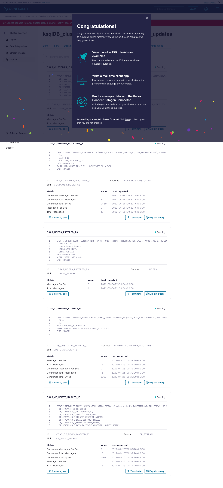

# Create a topic and a ksqlDB stream

Your ksqlDB cluster is provisioning! While you wait for your cluster to be ready, check out this video to learn more about ksqlDB.

- source 
    * [rate-movies.sql](ksql/rate-movies.sql)

---
# ksqlDB



## Create a topic and a ksqlDB stream
Your ksqlDB cluster is ready. Click on the cluster name to start creating ksqlDB streams and writing queries.

* cluster name __ksqlDB_cluster_notify_passengers_of_flight_updates__


## reate a topic and a ksqlDB stream
Click “Run query” to run the pre-populated query which will create a new Stream from a newly created kafka topic “users”. A Stream is an abstraction provided by Kafka Streams to represent that data from a topic.

* SQL
```sql
CREATE STREAM users  (id INTEGER KEY, gender STRING, name STRING, age INTEGER) WITH (kafka_topic='users', partitions=1, value_format='JSON');

-- Note: The editor is read-only during the ksqlDB Getting Started tutorial
```


* Result

```json
{
  "@type": "currentStatus",
  "statementText": "CREATE STREAM USERS (ID INTEGER KEY, GENDER STRING, NAME STRING, AGE INTEGER) WITH (KAFKA_TOPIC='users', KEY_FORMAT='KAFKA', PARTITIONS=1, VALUE_FORMAT='JSON');",
  "commandId": "stream/`USERS`/create",
  "commandStatus": {
    "status": "SUCCESS",
    "message": "Stream created",
    "queryId": null
  },
  "commandSequenceNumber": 22,
  "warnings": [

  ]
}
```

## Insert data with a query
Run this next query to insert data into your newly created users topic.

```sql
INSERT INTO users (id, gender, name, age) VALUES (0, 'female', 'sarah', 42);
INSERT INTO users (id, gender, name, age) VALUES (1, 'male', 'john', 28);
INSERT INTO users (id, gender, name, age) VALUES (42, 'female', 'jessica', 70);

-- Note: The editor is read-only during the ksqlDB Getting Started tutorial
```


## Set a param on a query
To start ksqlDB processing from the first message in your topic, set the auto.offset.reset to the earliest offset.

QUREY

```sql
SELECT id, gender, name, age FROM users WHERE age<65 EMIT CHANGES;

-- Note: The editor is read-only during the ksqlDB Getting Started tutorial
```


* Latest
    - result none
* Earliest
    - result 4


## Select data from your stream
You can see the results of your ksqlDB query here. Notice we are only showing users under the age of 65 due to our filter. Click Continue when you are done.


## Transform your data
Run this last query to get users under 65 and write them to a new topic called users_filtered that you can later use.

```sql
CREATE STREAM users_filtered AS SELECT id, gender, name, age FROM users WHERE age<65;

-- Note: The editor is read-only during the ksqlDB Getting Started tutorial
```

* Result
```json
{
  "@type": "currentStatus",
  "statementText": "CREATE STREAM USERS_FILTERED WITH (KAFKA_TOPIC='pksqlc-ox8p9USERS_FILTERED', PARTITIONS=1, REPLICAS=3) AS SELECT\n  USERS.ID ID,\n  USERS.GENDER GENDER,\n  USERS.NAME NAME,\n  USERS.AGE AGE\nFROM USERS USERS\nWHERE (USERS.AGE < 65)\nEMIT CHANGES;",
  "commandId": "stream/`USERS_FILTERED`/create",
  "commandStatus": {
    "status": "SUCCESS",
    "message": "Created query with ID CSAS_USERS_FILTERED_23",
    "queryId": "CSAS_USERS_FILTERED_23"
  },
  "commandSequenceNumber": 24,
  "warnings": [

  ]
}
```


## Check out the Persistent Queries tab
Now that you have successfully created a persistent query, navigate to the Persistent Queries tab to view your running persistent queries.


## Check out the Persistent Queries tab
From this view, you can see that you have successfully created a persistent query that will continue to process messages from users to users_filtered until you terminate it.


- TODO: Persistent Queries tab

---
fin.


